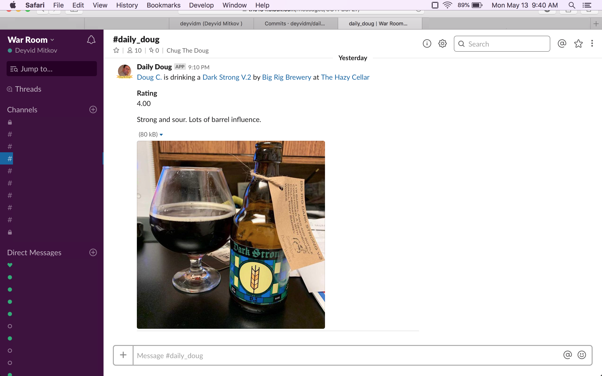

# Daily Doug

### Slack App for Doug's daily untappd beer reviews

The slack app is a simple Python web scraper using [Requests](http://docs.python-requests.org/en/master/) and [BeautifulSoup](https://www.crummy.com/software/BeautifulSoup/bs4/doc/).

### Setup 

To set this up for your workspace, paste the incoming webhook URL in the config file. 
The first run will fetch all visible checkins and 'bookmark' the latest so that future runs only fetch new checkins. 

### Example 

Here's what the output looks like. We've configured the scraper to run every 10 minutes and seem to get lots of notifications on Sundays :) 

